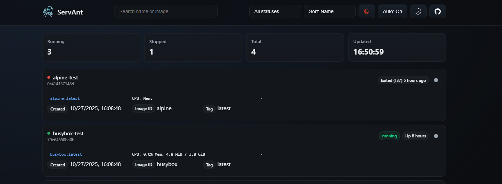

<p align="center">
	
</p>

# ServAnt - Containers served to you.

**ServAnt** is a lightweight, web-based Docker container dashboard that provides real-time monitoring and management of your containers. Built with Express and Dockerode, it offers a clean interface to view container status, resource usage, and basic metrics—all through a simple, responsive UI.

> [!WARNING]
>
> Agent is still in testing phase, please use at your own risk.
> 
> Report any found bugs here: https://github.com/Panonim/servant/issues

## Two Versions Available

- **ServAnt (Main)** - Interactive web dashboard with UI. Note: Main version of servant already contains agent. 
- **[ServAnt Agent](./servant-agent/)** - Headless API-only version with required token authentication for automation and remote monitoring

### Demo
You can access demo here: https://panonim.github.io/servant-demo/. 

# Installation 
Create project folder and grab necessary files from the repository. 
```bash
curl -o docker-compose.yml https://raw.githubusercontent.com/Panonim/servant/main/docker.example.yml
```

### Authentication

If `API_KEY` is set in production mode (`NODE_ENV=production`), API requests must include an `Authorization` header:
```
Authorization: Bearer YOUR_API_KEY
```

## Configuration

Configure ServAnt by editing the `.env` file or setting environment variables in `docker-compose.yml`:

| Variable | Default | Description |
|----------|---------|-------------|
| `PORT` | `6060` (main), `6061` (agent) | Port the server listens on |
| `HOST` | `0.0.0.0` | Host address to bind the server to |
| `LOG_LEVEL` | `info` | Logging verbosity: `error`, `warn`, `info`, `debug` |
| `TIME_SOURCE` | `local` | Time source for timestamps: `browser` (client timezone) or `local` (server timezone) |
| `TIME_FORMAT` | `24h` | Time format: `24h` or `12h` |
| `TZ` | `UTC` | Timezone for server-side timestamps (e.g., `America/New_York`, `Europe/London`) |
| `USE_HTTPS` | `true` | Enable HTTPS-specific security features (set to `false` for local HTTP development) |
| `API_KEY` | (none) | Optional API key for authentication (Bearer token) - main app only |
| `RATE_LIMIT` | `120` (main), `60` (agent) | Maximum requests per window |
| `RATE_WINDOW_MS` | `60000` | Rate limiting window in milliseconds (default: 1 minute) |
| `TRUST_PROXY` | `false` | Set to `true` if behind a reverse proxy |
| `DOCKER_SOCKET_PATH` | `/var/run/docker.sock` | Path to Docker socket |
| `STREAM_MAX_MS` | `300000` | Maximum duration for streaming stats connections (5 minutes) |
| `KEEP_ALIVE_MS` | `10000` | Keep-alive timeout for connections |
| `SHUTDOWN_GRACE_MS` | `1500` | Grace period for shutdown (milliseconds) |
| `ALLOWED_HOSTS` | (none) | Comma-separated list of allowed hostnames for requests - agent only |
| `ALLOWED_ORIGINS` | (none) | Comma-separated list of allowed CORS origins - agent only |
| `AGENT_TOKEN` | (required for agent) | Authentication token for agent API access - agent only |
| `AGENT_*_URL` | (none) | Environment variable pattern for defining remote agents (e.g., `AGENT_REMOTE_URL=http://remote:6061`) - main app only |
| `AGENT_*_TOKEN` | (none) | Corresponding token for remote agents - main app only |
| `AGENT_*_NAME` | (none) | Optional display name for remote agents - main app only |

# Star History

<a href="https://www.star-history.com/#panonim/servant&type=date&legend=bottom-right">
 <picture>
   <source media="(prefers-color-scheme: dark)" srcset="https://api.star-history.com/svg?repos=panonim/servant&type=date&theme=dark&legend=bottom-right" />
   <source media="(prefers-color-scheme: light)" srcset="https://api.star-history.com/svg?repos=panonim/servant&type=date&legend=bottom-right" />
   
 </picture>
</a>

## API Endpoints

ServAnt exposes the following API paths:

### Public Endpoints
- **`GET /healthz`** - Health check endpoint (returns `ok` as plain text)
- **`GET /`** - Main dashboard (serves the web UI)

### Docker API Endpoints

All Docker API endpoints are prefixed with `/docker` and are protected by rate limiting and optional API key authentication.

- **`GET /docker/containers/json?all=1`** - List all containers
  - Query params:
    - `all` (optional): Set to `1` or `true` to show all containers (including stopped ones)
  - Returns: JSON array of container objects with filtered fields (Id, Names, Image, ImageID, Command, Created, State, Status, Ports)

- **`GET /docker/containers/:id/stats?stream=1`** - Get container resource statistics
  - Path params:
    - `id`: Container ID (12-64 hex characters)
  - Query params:
    - `stream` (optional): Set to `1` for streaming stats (NDJSON format), or `0` for a single snapshot
  - Returns: Container statistics including CPU, memory, and network usage
  - Note: Streaming connections have a maximum duration of 5 minutes (configurable via `STREAM_MAX_MS`)

## Support

- Report issues: https://github.com/Panonim/servant/issues